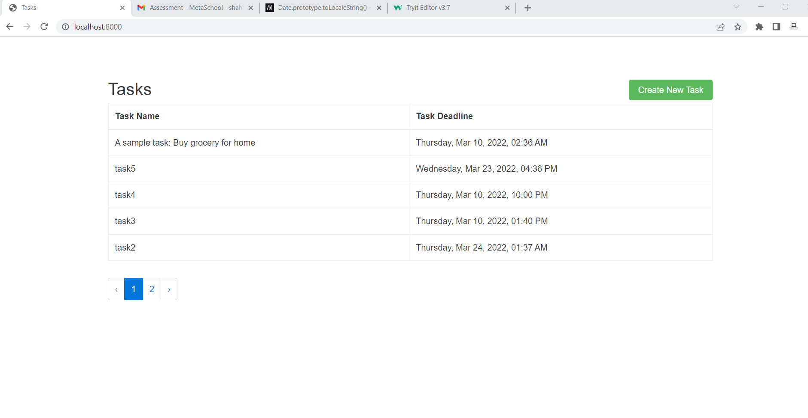
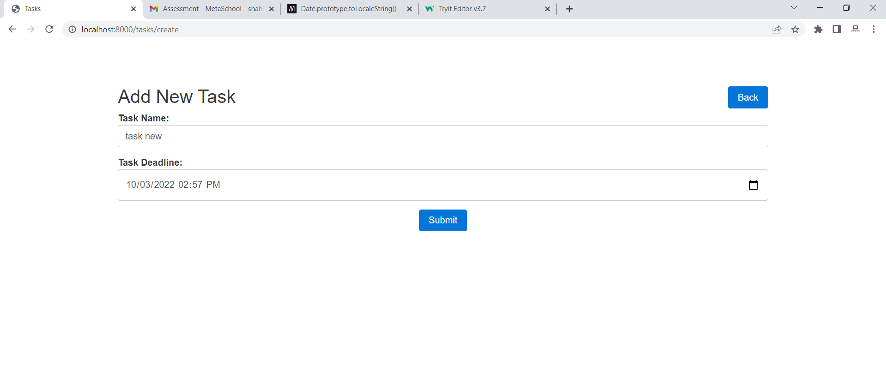
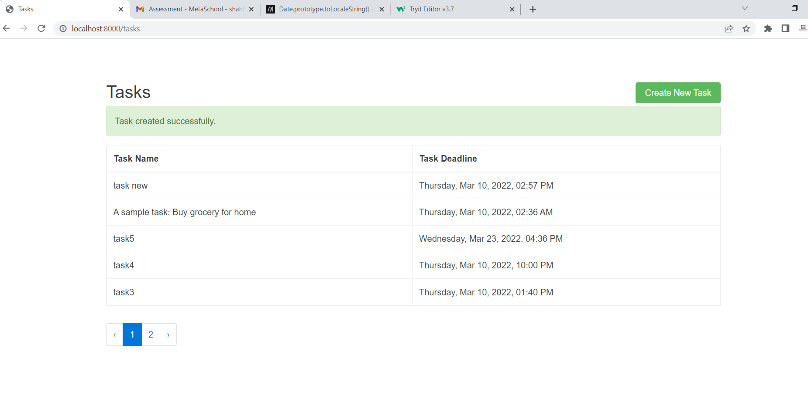

1 take a pull
 
2 Create database 'to_do_app'
 
3 create env file and set db credentials
 
4 Run below Commands on project root
 
composer install
 
php artisan migrate
 
php artisan config:cache
 
php artisan route:cache
 
php artisan serve
 
Project Screen shoots

